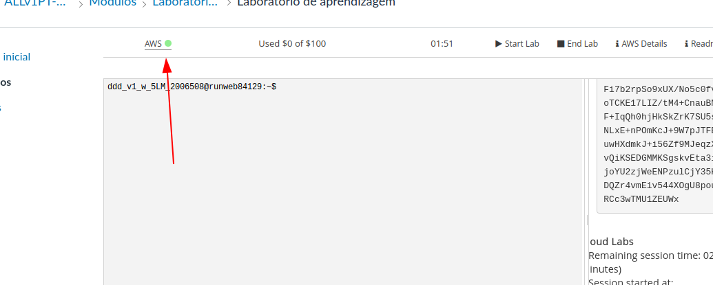

# RoadTracker

This is a system of vehicle monitoring.

To run, follow the instructions below:

# IN LOCAL HOST

## Setup the Enviroment

### Apache Kafka enviroment:

Ensure that you have Java installed locally (Kafka uses Java). Then:

1. Install the binary release of Kafka [here](https://kafka.apache.org/downloads) and extract with the following commands:
   ``tar -xzf kafka_<VERSION>.tgz ``
   ``cd kafka_<VERSION> ``

2. Start the Kafka enviroment. For this, you need to
    - Start the ZooKeeper Service:
      bin/zookeeper-server-start.sh config/zookeeper.properties. It's like a "backend" for Kafka Broker.

    - In another terminal, start the Kafka Broker Service:
      bin/kafka-server-start.sh config/server.properties

3. Now, you need to create the topic "sensor-data", where the applications are going to write/read events. For this, execute:
   bin/kafka-topics.sh --create --topic sensor-data --bootstrap-server localhost:9092

> Obs: the local boostrap-server "localhost:9092" is the default server and port of Kafka configurations.

#### Testing the Kafka enviroment
You can test if the local Kafka enviroment is working executing a local consumer and a local producer. For this, you need to:
1. Open a terminal that is your producer
   bin/kafka-console-producer.sh --topic sensor-data --bootstrap-server localhost:9092

2. Open a terminal that is your consumer
   bin/kafka-console-consumer.sh --topic sensor-data --from-beginning --bootstrap-server localhost:9092

Now, you can write messages in the producer console and see if the consumer console is receiving it.

### MongoDB database

To run locally, you need to have mongodb installed. If not, you can follow the [documentation](https://www.mongodb.com/docs/manual/installation/)
to install it.

## Produce data (local/mock/mock.py)
To produce data, run 

python3 local/mock.py

This will send data to Kafka broker.

## Send data to mongodb (local/subscribeMongo.py)
To subscribe data to the database data, run

python3 local/subscribe.py

This will receive data from Kafka broker, acting as consumer, and sending data to the local MongoDB.

## Process data (local/etl/analysisLocal.py)
To process data, run

python3 local/analysis.py

## Visualizing data (local/dash/app.py)
To visualize data, run

python3 local/dash.py

This will create a server and show a dashboard into your localhost:8050. The information in this dashboard is update
every 500ms.

# IN AWS

All the process of cloud implementation is described on the following topics, but can be viewed on (this video)[insert_url_here].  

## Introduction

For this project, we are going to use the [AWS Academy](https://awsacademy.instructure.com) platform. You need to login,
go to Courses > Modules > Learner Lab. Then, you need to click on "Start Lab" and wait to start your AWS navigation.

First of all, you need to start some services from AWS. We record videos with the detailed configuration of each service, being:
- ECS
- Redshift Database
- EMR with S3
- EC2

### Getting your AWS key-pair credentials

First of all, you need to get your AWS key-pair credentials. For this, you need to go to the AWS Academy page, click on "AWS Details". 
Then, download the .pem file for Linux and .ppk for Windows.

> OBS: every time that the lab is restarted, these credentials changes (as well as the ip's for the services that were created).

### Configure and upload archive to the AWS S3 Bucket
The next step is to configure the bucket where we're going to save some files that we'll need to run our services.

On the AWS academy home page, click on the green button, as show in the figure.

After that, you're effectively in the AWS menu. Now, search for "S3" in the search bar and click on the service.
After that, click on "Create bucket". On the creation page, give the name "*roadtracker*" for the bucket and then click 
on "Create Bucket" at the end of the page.

Now, upload to the bucket the file `aws/analysis.py`.

### Create redshift database
To create the redshift database, that is our datasource for ETL, run

python3 aws/create_redshift.py

### Deploy docker container into ECS
> TODO

### Deploy mongodb database and dashboard into AWS EC2

### Deploy pyspark script into EMR
Search for "EMR" in the search bar and click on the service. Click on "Create cluster". Set the cluster with this caracteristicals:
- version: emr-6.11.0 (with spark 3.3.2)
- key-pairs of ec2: vockey
Others configurations could be maintaned default.

After that, the cluster will be "initializing". When it's done, the status will be "waiting" and we need to connect via SSH to the master node of EMR.

At this moment, you have to guarantee that the inbound rule to connect to EMR by SSH it's open. To do that:
- click on the cluster that you created;
- go to "Summary";
- In "Security and Access", click on the security group for the MASTER node;
- On the new page, select the group of the Master node;
- Go to the tab "Inbound Rules";
- Ensure that you have a rule like the figure below. If not, create one.
  

Now, you can connect to the master node. Open a terminal on the same folder that you download your key-pair and run

ssh -i <file_of_key_pair> hadoop@<public_dns_of_emr>

On the EMR master node, you need to copy the `analysis.py` file to your cluster and run it. For this, run

aws s3 cp <s3-uri-for-analysis-file>

Finally, run

   spark-submit \
      --packages org.mongodb:mongodb-driver:3.12.11,com.amazon.redshift:redshift-jdbc42:2.1.0.12,org.mongodb.spark:mongo-spark-connector_2.12:10.1.1 \
       analysisMongo.py 